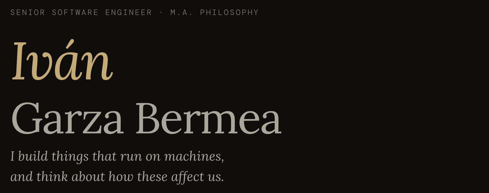

[](https://ivangarzab.com)
[](https://github.com/ivangarzab)
[](https://linkedin.com/in/ivangarzab)
[](https://medium.ivangarzab.com)
[](https://substack.com/@ivangarzab)

<h1>
  
  ivangarzab.com
</h1>



## Stack

Built with **Claude**: Vite + React + TypeScript. Deployed on Vercel.

- **React** — component-per-section architecture
- **TypeScript** — shared types in `src/types.ts`
- **Vite** — dev server and build
- **Formspree** — contact form submissions
- **Vercel** — hosting and CI/CD

## Project structure

```
src/
  components/       # One file per section
    Nav.tsx
    Hero.tsx
    About.tsx
    Experience.tsx
    Projects.tsx
    Writing.tsx
    Contact.tsx
    Footer.tsx
  App.tsx           # Fetches all data, composes layout
  types.ts          # Shared interfaces
  index.css         # All styles (single file, no CSS modules)

public/
  data/             # Content as JSON — edit here, no code changes needed
    experience.json
    projects.json
    writing.json
    quotes.json
  images/           # Project card icons
  icons.svg         # SVG sprite (social/UI icons)
  logo.svg          # Browser tab favicon
```

## Development

```bash
npm install
npm run dev       # localhost:5173
npm run build     # type-check + production build
npm run preview   # preview production build locally
npm run lint      # ESLint
```

## Updating content

All content lives in `public/data/`. No code changes required:

| File | What to edit |
|---|---|
| `experience.json` | Work history — add `"url"` to linkify a company name |
| `projects.json` | Projects — `"icon"` points to a file in `public/images/` |
| `writing.json` | Published articles |
| `quotes.json` | Footer quotes — one is picked at random on each load |
